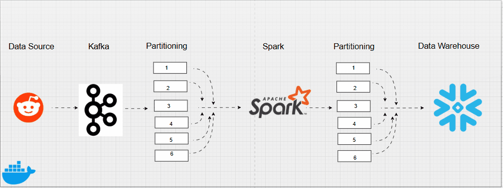

# Real-Time Big Data Project

  


The project implements a **real-time data pipeline** that extracts data from Reddit, streams it through Apache Kafka, processes it with Apache Spark, and loads it into a **Snowflake** data warehouse. All components are containerized with Docker for easy deployment.

---

## Project Overview

* **Data Source**: Reddit data extracted with a Python script (via PRAW).
* **Streaming**: Apache Kafka handles real-time data ingestion.
* **Processing**: Apache Spark processes and transforms the data.
* **Data Warehouse**: Processed data is stored in Snowflake.
* **Containerization**: Each component (Producer, Kafka, Spark Consumer) is deployed using Docker.

---

##  Setup and Deployment

Clone the repo then deploy 
```bash
docker comose up -d
```
### 1. Extract Data from Reddit (Producer)

* A Python script fetches Reddit submissions and sends them to Kafka.
* The script is containerized for reproducible deployment.


```bash
# Build producer image
docker build -t reddit-kafka-producer .

# Run producer container
docker run -d --env-file .env --network="host" reddit-kafka-producer
```

---

### 2. Kafka Streaming

* Kafka manages the real-time stream, including partitioning for distribution.
* Example checks:

```bash
# Check cluster info
docker exec -it redpanda-1 rpk cluster info  

# Consume topic messages manually
docker exec -it redpanda-1 rpk topic consume reddit-json-stream  
```

---

### 3. Spark Processing (Consumer)

* Apache Spark consumes from Kafka, transforms the data, and loads into Snowflake.

```bash
# Build consumer image
docker build -t reddit-spark-consumer .

# Run consumer container
docker run -d --env-file .env --network="host" reddit-spark-consumer
```

* Test locally before deploying with Spark submit:

```bash
spark-submit \
  --packages org.apache.spark:spark-sql-kafka-0-10_2.12:3.5.1,net.snowflake:spark-snowflake_2.12:3.1.3 \
  consumer.py
```

---

### 4. Snowflake Integration

* Processed data is stored in **Snowflake** using the [Spark-Snowflake Connector](https://repo1.maven.org/maven2/net/snowflake/spark-snowflake_2.12/).

---

## Prerequisites

* [Docker](https://docs.docker.com/)
* [Python](https://www.python.org/)
* [Apache Kafka](https://kafka.apache.org/)
* [Apache Spark](https://spark.apache.org/)
* [Snowflake account](https://www.snowflake.com/)

---

##  Notes

* Configure **Kafka and Spark partitioning** for optimal performance.
* Always check Docker container logs if deployment fails.


---

 With this pipeline, Reddit data flows in **real-time** from ingestion → processing → warehousing, enabling analytics and insights at scale.

